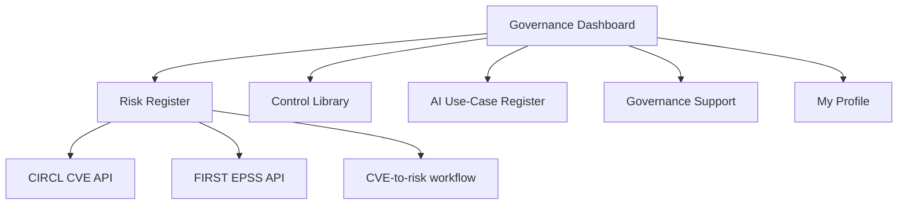
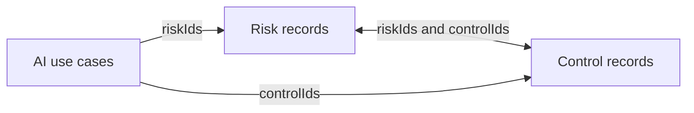

# GRC & AI Governance Control Hub - Version 23.3

Masters-level academic prototype for module **55-709700 Web Technologies**.

All application data is fictional or synthetic. No confidential organisational information is used.

## Project overview

GRC Hub is a responsive, client-side Governance, Risk, Compliance and AI Governance prototype. It integrates six principal application areas:

- Governance Dashboard
- Risk Register
- Control Library
- AI Use-Case Register
- Governance Support
- My Profile

The application demonstrates semantic HTML5, Bootstrap 5, targeted custom CSS, JavaScript, browser-based persistence, responsive design, accessibility techniques and external API integration.

The governance model links risks, controls and AI use cases through common identifiers. Dashboard widgets aggregate information from these datasets to provide Relationship Health, Framework Coverage, upcoming AI reviews and other governance metrics.

The Risk Register also integrates external cyber-threat intelligence from the **CIRCL CVE API** and **FIRST EPSS API**, allowing vulnerability information to be enriched and converted into browser-persisted risk records.

## AI assistance - AITS Level 1 

   
   The concept for this application originated from early ideas for a potential
   Governance, Risk and Compliance project involving dashboards for OneTrust
   workflows. Intial scaffold was shared to build on and develop further
   No confidential organisational information or live OneTrust data
   is included.
   I confirm that no generative AI tools were used to design, structure or develop 
   any part of the technical or written work thereafter for this assignment. All code, 
   design decisions, testing and written content were created and verified by me.

   Only standard embedded proofreading features (spell‑check, grammar, clarity and style suggestions) 
   in Microsoft Word and formatting tools in Visual Studio Code were used. 
   These tools did not generate any substantive content or code.

   I take full responsibility for all submitted work. 

## Final submitted build

The final submitted application is **Version 23.3**.

Version 23.3 retains the substantive functionality introduced through the earlier development stages, including the Version 21 API, validation, accessibility and print enhancements, while refining the visual presentation through selective use of the project's SVG artwork.

Key Version 23.3 refinements include:

- compact image-backed page headers across the six principal pages;
- selective reuse of circuit, neural and mesh SVG artwork;
- stronger visual treatment of the Dashboard, Relationship Health, Framework Coverage, Upcoming AI Reviews, Governance Insight and CVE lookup areas;
- reduced white header fade while maintaining readable foreground content;
- improved Governance Support contact cards and response-target presentation;
- additional spacing beneath the Governance Support contact-card grid;
- correction and redeployment of the Risk Register heat-map contrast styling;
- correction of the Governance Insight artwork/contrast regression identified during manual accessibility review.

The final presentation deliberately retains a compact operational layout rather than returning to the large decorative hero banners used in earlier iterations.

## Application architecture

The application uses a multi-page client-side architecture.



Governance relationships are maintained using common identifiers:




Browser-based storage is used for user-generated records while baseline synthetic data remains in local JSON files.

This keeps the prototype compatible with GitHub Pages while demonstrating interconnected governance workflows without requiring server-side infrastructure.

## Run locally

Serve the project folder over HTTP rather than opening the HTML files directly, because the JSON datasets are loaded using `fetch()`.

For example:

```bash
cd grc-hub
python3 -m http.server 8000
```

Alternatively, use the VS Code Live Server extension. Then open <http://localhost:8000>.


## Project links

- **GitHub repository:** https://github.com/gpdeacon2712/web-site-projects
- **Assignment source folder:** https://github.com/gpdeacon2712/web-site-projects/tree/main/assignment
- **Module weekly coursework and assignments:** https://gpdeacon2712.github.io/web-site-projects/
- **Direct GRC Hub assignment:** https://gpdeacon2712.github.io/web-site-projects/assignment/index.html

## GitHub Pages deployment

The application is deployed using GitHub Pages.

**Module site:** https://gpdeacon2712.github.io/web-site-projects/

**Direct assignment:** https://gpdeacon2712.github.io/web-site-projects/assignment/index.html

**Assignment source:** https://github.com/gpdeacon2712/web-site-projects/tree/main/assignment

The canonical pages are:

- `index.html`
- `risks.html`
- `controls.html`
- `ai-register.html`
- `governance-support.html`
- `my-profile.html`

The Governance Support and Profile routes use `governance-support.html` and `my-profile.html` as their canonical filenames.

## Core functionality

### Governance Dashboard

- Data-driven governance metrics.
- Relationship Health linking AI use cases, risks, controls and risk-control coverage.
- Framework Coverage generated from Control Library mappings.
- Upcoming AI Reviews sorted chronologically.
- Governance Insight banner using live dataset values.
- Direct navigation from relationship and review widgets into relevant registers.

### Risk Register

- Risk ID, description, ownership, likelihood, impact and overall rating.
- 5×5 accessible risk heat map.
- Alternative SVG bubble visualisation.
- Search, filtering and CSV export.
- Linked mitigating controls.
- Browser-persisted user-created risk records.
- CIRCL CVE and FIRST EPSS integration.
- CVSS-to-impact and EPSS-to-likelihood decision-aid mapping.
- Direct CVE-to-risk creation.
- Partial API-result handling and provider-specific failure messages.
- Per-provider session caching and HTTP 429 guidance.

### Control Library

- Governance control catalogue.
- Framework and implementation-status filtering.
- Search by control or linked risk information.
- Reciprocal risk-to-control relationships.
- Framework mappings.
- CSV export.
- Responsive, scrollable register presentation on larger screens.

### AI Use-Case Register

- Registration of AI use cases.
- Data-category and governance-assessment controls.
- Risk-rating range input with live feedback.
- AI-specific risks and recommended controls.
- Framework-alignment selection.
- Review dates and ownership.
- Browser-persisted user-created use cases.
- CSV export.

### Governance Support

- Structured governance request form.
- Request category, priority, requester, department, related record, subject and message fields.
- Required confirmation that only fictional or non-sensitive data is entered.
- Browser-local request persistence.
- Sequential support identifiers.
- Saved-request view and CSV export.
- Contextual pre-population from other modules.
- Governance contact cards and response targets.
- Accessible FAQ using native `<details>` and `<summary>` elements.

### My Profile

- Profile and departmental information.
- Governance responsibility information.
- Session-based interaction.
- Accessible labelled controls and grouped options.

## Accessibility

Accessibility was considered throughout development rather than added only at the end.

Implemented techniques include:

- semantic landmarks and logical heading structure;
- skip links;
- explicit labels for form controls;
- `<fieldset>` and `<legend>` grouping;
- `aria-describedby` for hints and validation feedback;
- `aria-invalid` for invalid controls;
- `aria-current` for current navigation state;
- `aria-live` regions for dynamic status information;
- visible keyboard focus using `:focus-visible`;
- keyboard-operable navigation and forms;
- reduced-motion support using `prefers-reduced-motion`;
- responsive removal of problematic nested scrolling on smaller screens;
- text or position in addition to colour for risk/status communication.

### Accessibility testing

Testing included:

- WAVE;
- Axe DevTools;
- Lighthouse;
- keyboard-only navigation;
- structured manual accessibility review;
- responsive viewport testing.

The Risk Register heat map initially exposed a contrast problem when an opacity-based treatment reduced the effective contrast of unoccupied cells. The correction replaced the opacity treatment with fixed light tints and dark text. After the corrected stylesheet was redeployed, WAVE reported **0 errors and 0 contrast errors**, and the Risk Register desktop Lighthouse Accessibility score improved from **97 to 100**.

A separate Governance Insight contrast regression caused by layered feature artwork was identified during manual review and corrected before final submission.

The Control Library retains a minor future-refinement opportunity around linked-reference touch-target spacing.

## ## Lighthouse testing

Lighthouse 13.4.1 testing was conducted against the published GitHub Pages application rather than a local development copy.

### Initial testing - 6 August 2026

Initial desktop testing covered all six principal application pages, with an additional mobile assessment of the Risk Register.

#### Initial desktop scores

| Page                 | Performance | Accessibility | Best Practices | SEO |
| -------------------- | ----------: | ------------: | -------------: | --: |
| Governance Dashboard |          93 |           100 |            100 | 100 |
| Control Library      |          86 |            97 |            100 | 100 |
| Risk Register        |          83 |           100 |            100 | 100 |
| AI Use-Case Register |         100 |           100 |            100 | 100 |
| Governance Support   |         100 |           100 |            100 | 100 |
| My Profile           |          99 |           100 |            100 | 100 |

The Risk Register initially recorded Accessibility 97 before correction of the identified colour-contrast problem. The value shown above represents the corrected desktop result following redeployment and retesting on 6 August 2026.

#### Initial desktop performance metrics

| Page                 |   FCP |   LCP | Total Blocking Time |   CLS |
| -------------------- | ----: | ----: | ------------------: | ----: |
| Governance Dashboard | 0.6 s | 0.6 s |                0 ms | 0.154 |
| Control Library      | 0.7 s | 0.7 s |                0 ms | 0.273 |
| Risk Register        | 0.7 s | 0.7 s |                0 ms | 0.348 |
| AI Use-Case Register | 0.6 s | 0.6 s |                0 ms | 0.001 |
| Governance Support   | 0.7 s | 0.7 s |                0 ms | 0.017 |
| My Profile           | 0.7 s | 0.7 s |                0 ms | 0.001 |

The principal performance limitation was layout stability on dynamically rendered pages rather than blocking JavaScript. The Risk Register and Control Library recorded the highest CLS values.

#### Initial mobile Risk Register assessment

| Metric                   | Result |
| ------------------------ | -----: |
| Performance              |     90 |
| Accessibility            |     96 |
| Best Practices           |    100 |
| SEO                      |    100 |
| First Contentful Paint   |  2.6 s |
| Largest Contentful Paint |  2.7 s |
| Speed Index              |  4.3 s |
| Total Blocking Time      |   0 ms |
| Cumulative Layout Shift  |  0.000 |

The initial mobile Accessibility score of 96 reflected the same Risk Register heat-map contrast problem identified during desktop testing. This result is retained as evidence of the issue that subsequently triggered corrective action.

### Final Lighthouse retesting - 3 September 2026

Following completion of the final accessibility and usability corrections, the Governance Dashboard and Risk Register were reassessed using both desktop and mobile Lighthouse profiles.

| Page and profile              | Performance | Accessibility | Best Practices | SEO |   FCP |   LCP | Speed Index |  TBT |   CLS |
| ----------------------------- | ----------: | ------------: | -------------: | --: | ----: | ----: | ----------: | ---: | ----: |
| Governance Dashboard, Desktop |          93 |           100 |            100 | 100 | 0.7 s | 0.7 s |       0.7 s | 0 ms | 0.154 |
| Governance Dashboard, Mobile  |          93 |           100 |            100 | 100 | 2.6 s | 2.6 s |       2.9 s | 0 ms | 0.020 |
| Risk Register, Desktop        |          83 |           100 |            100 | 100 | 0.7 s | 0.7 s |       0.7 s | 0 ms | 0.348 |
| Risk Register, Mobile         |          86 |           100 |            100 | 100 | 2.4 s | 2.5 s |       2.4 s | 0 ms | 0.187 |

All four final assessments achieved Accessibility 100, Best Practices 100 and SEO 100.

The improvement in the mobile Risk Register from Accessibility 96 in the initial assessment to Accessibility 100 in the final retest provides direct evidence that the corrected heat-map styling remained effective in the mobile presentation as well as on desktop.

The Risk Register retained measurable Cumulative Layout Shift, recording 0.348 on desktop and 0.187 on mobile. This remains a production optimisation opportunity rather than an accessibility defect.

## Standards and functional testing

Completed testing includes:

* deployment to GitHub Pages;
* W3C HTML validation across all six principal application pages;
* CIRCL and FIRST EPSS testing from the deployed HTTPS origin;
* WAVE accessibility testing;
* Axe DevTools testing;
* Lighthouse desktop and mobile testing;
* keyboard-only operation;
* structured manual accessibility testing;
* responsive testing across desktop, tablet and mobile layouts;
* functional testing of navigation, search, filtering, forms, validation and interactive components.

Final W3C Nu HTML Checker validation confirmed that all six principal application pages passed the planned HTML validation checks with no material validation errors remaining.

The Risk Register heat-map contrast issue identified during automated testing was corrected by replacing the opacity-based treatment with fixed tints and dark text. Following redeployment, WAVE recorded 0 errors and 0 contrast errors, the planned Axe DevTools retest passed, and both desktop and mobile Risk Register Lighthouse assessments achieved Accessibility 100.

## Key technical design decisions

### Native HTML before custom scripting

Native form controls and semantic HTML were preferred where possible because they provide built-in browser behaviour, keyboard support and assistive-technology semantics.

Examples include:

- `<fieldset>` / `<legend>`;
- `type="email"`;
- `<datalist>`;
- `<select multiple>`;
- `type="range"` with `<output>`;
- `<details>` / `<summary>`.

### Bootstrap plus targeted custom CSS

Bootstrap 5 provides the common page shell, responsive grid, navigation, cards, forms, tables and spacing utilities.

Custom CSS is retained for GRC-specific components such as:

- risk visualisations;
- linked-record highlighting;
- status accents;
- operational feature artwork;
- print-specific register presentation.

This hybrid approach reduces handwritten layout CSS while preserving the domain-specific visual identity.

### Resilient API handling

The CIRCL CVE and FIRST EPSS providers are independent. The lookup therefore uses `Promise.allSettled()` so a successful result from one provider is not discarded if the other fails.

The application also provides:

- provider-specific error messages;
- HTTP 429 rate-limit guidance;
- per-provider caching;
- duplicate-request protection;
- visible loading state;
- `aria-busy` status;
- partial-result rendering.

### Browser-local persistence

User-generated risks, AI use cases and Governance Support requests can be retained locally in the browser.

This is suitable for the academic prototype but is not intended as a production persistence model. A production GRC system would require authenticated server-side storage, role-based access control, encryption, retention rules and auditable workflows.

## Development history

### Initial prototype

- Semantic multi-page structure.
- Responsive navigation.
- Starter CSS.
- Synthetic JSON datasets.
- Basic Risk, Control and AI views.

### Versions 7–9 - API robustness

- Made CVE validation case-insensitive.
- Linked CVE format guidance using `aria-describedby`.
- Hardened EPSS parsing.
- Replaced `Promise.all()` with `Promise.allSettled()`.
- Added status-specific API failure guidance.
- Documented observed CIRCL rate limiting.
- Added per-provider caching, cooldown behaviour and `Retry-After` guidance.

### Versions 10–13 - risk visualisation and governance integration

- Added 1–5 likelihood and impact scoring.
- Added accessible 5×5 risk heat map.
- Added dependency-free SVG bubble visualisation.
- Added CVE-to-risk workflow.
- Added browser-local persistence and CSV export.
- Added reciprocal risk-to-control mappings.
- Added AI use-case-to-risk and AI use-case-to-control relationships.
- Added governance coverage metrics to the dashboard.

### Version 14 - Governance Support

- Added Governance Support as the sixth principal page.
- Added structured browser-local governance request workflow.
- Added contextual links from Risks, Controls and AI.
- Added saved requests, CSV export and accessible FAQ content.

### Versions 15–18 - dashboard evolution

- Added module icons and visual accents.
- Added data-driven Governance Insight.
- Added Framework Coverage.
- Added Relationship Health.
- Added Upcoming AI Reviews.
- Added direct relationship links between dashboard information and registers.
- Retained responsive and reduced-motion behaviour.

### Version 19 - Bootstrap hybrid architecture

- Introduced Bootstrap 5 for the shared page shell and standard components.
- Reduced duplicated custom layout styling.
- Retained custom CSS for specialist GRC components and visualisations.

### Version 20 - compact operational headers

- Introduced compact, task-focused page headers.
- Improved page actions and anchor navigation.
- Reduced oversized decorative banner treatment.

### Version 21 - API, accessibility and print enhancements

- Added recent-CVE datalist suggestions.
- Added accessible API busy states.
- Prevented duplicate submissions during active requests.
- Added progressive inline validation using `aria-describedby` and `aria-invalid`.
- Refined CVE-to-risk workflow behaviour.
- Added print-specific Risk Register and Control Library presentation.

### Version 23.3 - final visual and accessibility refinement

- Reused SVG artwork as a restrained background layer.
- Strengthened artwork visibility while preserving readable text areas.
- Refined the Dashboard, relationship widgets and CVE panel presentation.
- Improved Governance Support contact-card presentation.
- Corrected the Governance Insight contrast regression.
- Redeployed the corrected Risk Register heat-map styling and confirmed the desktop accessibility improvement.

## Known limitations and future development

The application is intentionally a client-side prototype and does not include:

- authentication;
- central server-side persistence;
- multi-user collaboration;
- role-based access control;
- workflow approvals;
- enterprise audit logging;
- managed API service agreements.

Future production refinement could include:

- PostgreSQL or another server-side database;
- secure REST API;
- Microsoft Entra ID or OAuth-based authentication;
- role-based access control;
- workflow approvals and audit trails;
- Power BI or similar analytics integration;
- enhanced AI governance lifecycle evidence;
- reserved loading space or skeletons to reduce CLS;
- larger Control Library linked-reference touch targets;
- customised or purged Bootstrap assets;
- CSS and JavaScript minification;
- improved caching and production security headers.

## Assessment evidence map

| Assessment area | Representative evidence |
|---|---|
| HTML | Semantic landmarks, accessible tables, links, headings and structured page content |
| CSS | Mobile-first responsive design, custom properties, advanced selectors, print styles and reduced motion |
| HTML Forms | Fieldsets/legends, email input, datalist, multiple select, range/output and validation |
| JavaScript | Dynamic rendering, filtering, form handling, persistence, validation and visualisation |
| API integration | CIRCL CVE + FIRST EPSS, partial-result handling, caching and CVE-to-risk workflow |
| Accessibility / UI | Semantic HTML, explicit labels, keyboard focus, ARIA live regions, responsive behaviour and automated/manual testing |

## Academic integrity and project ownership

This repository documents an academic prototype and its iterative development history.

AI assistance was limited to AITS Level 1 The author developed, extended, tested, evaluated and refined the application and is responsible for the final submitted work.

External technical references and standards used in the accompanying report are cited there in accordance with the required academic referencing approach.
